# Bamazon
***
## Introduction

An app created using Node.js and MySQL to display an Amazon-like storefront. Users can interact with the app as a customer, and view the product inventory and make changes to it as a manager.

## SetUp
* To clone this repository to your local computer, please copy the link(via git clone) and run the command "git clone linkurl" in your terminal.

## Packages 
Please install the packages below to display the app in your terminal correctly:
* npm inquirer
* npm mysql
* Additional packages can be found at https://www.npmjs.com

### Customer View
* Run the application by typing the command "node bamazonCustomer.js" in your terminal.

* Users will see the following message:

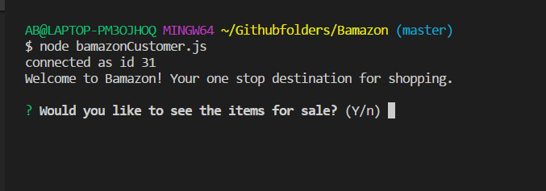

* Upon selecting 'Y', users will see all of the items available for sale. Refer to the next image for an example:

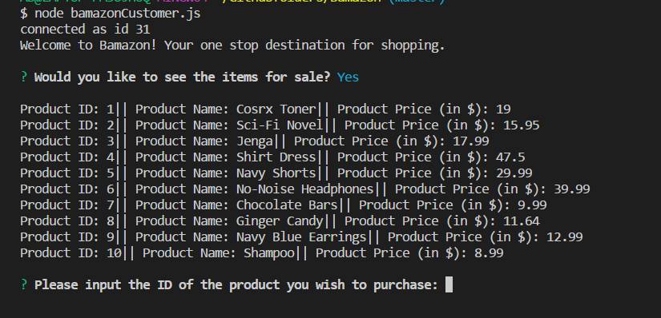

* To purchase an item, please indicate the ID of the product AND the number of units of a product you wish to purchase

* If stock is running low (less than 5 units remaining), users will see the following message:

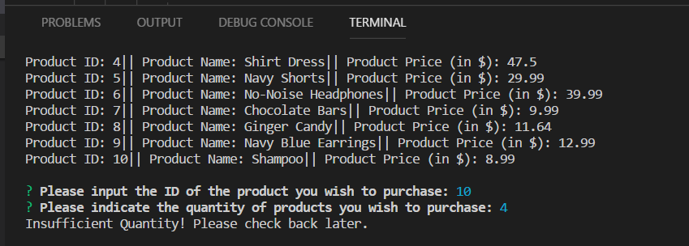

ELSE

* You will be able to purchase the item and a confirmation message will display, such as:

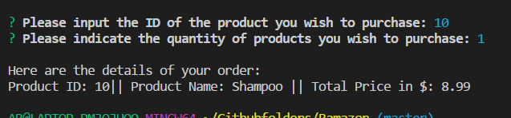

* This app also UPDATES the SQL database to reflect the remaining quantity.

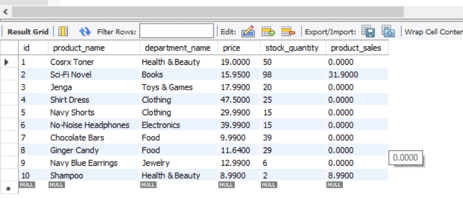

***

### Manager View
Managers using this app will be able to:
* View Products for Sale
* View Low Inventory
* Add to Inventory
* Add New Product

1. VIEW PRODUCTS FOR SALE
* Upon selecting the first option,this app will list every available item: the item IDs, names, prices, and quantities.

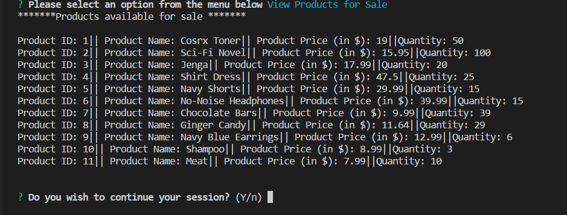

***

2. VIEW LOW INVENTORY
*  Selecting this option will list all items with an inventory count lower than five.

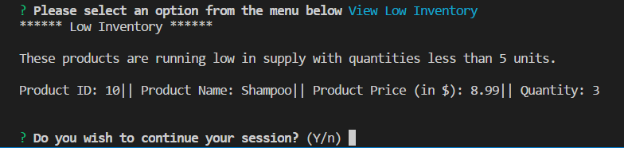

***

3. ADD TO INVENTORY
* The option displays a prompt that will let the manager "add more" of any item currently in the store.

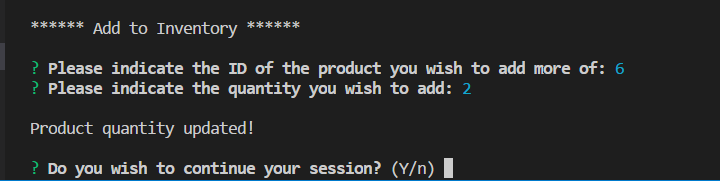

UPDATE can be noted in the SQL database:

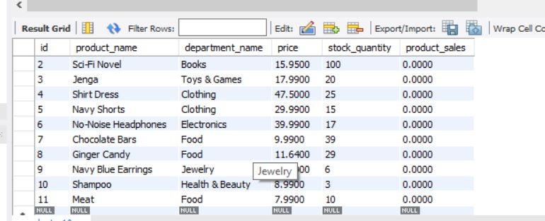

*** 

4. ADD NEW PRODUCT
* Selecting this option will allow the manager to add a completely new product to the store.

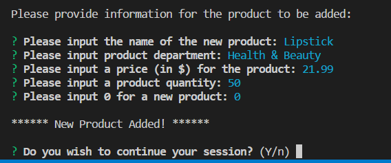

UPDATE can be noted in the SQL database (Lipstick row added to the table):

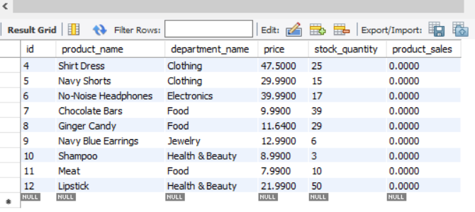

***

## Technologies Used
* Node.js
* MySQL
* Javascript

***

 ## Copyright
 Apbh (2018). All Rights Reserved

